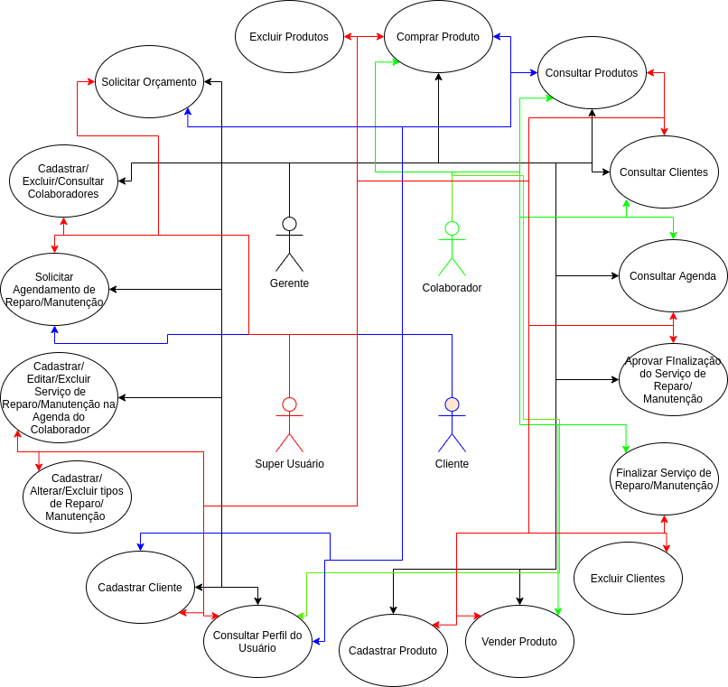

# Loja de Refrigeração

Um software, de código aberto, que está em desenvolvimento utilizando a linguagem Javascript e combinação de ferramentas VUE.JS para a código que será executado no navegador e NODE.JS para o código que será executado no servidor. Tem por objetivo gerenciar uma loja de refrigeração chamada Refrigeração Castro, localizada em Mogi Mirim/SP, mas poderá servir como ponto de partida para outras lojas do segmento.

<p align="center">
  
</p>

## Como executar

Requisitos: Node.js 24 ou mais recente, pnpm 12 e Docker.

```
pnpm install
pnpm dev
```

O comando sobe o PostgreSQL e o Mailpit no Docker, compila os pacotes e inicia a API e o site.

* Site: http://localhost:3000
* API: http://localhost:3001 (documentação em `/api/docs`)
* Emails enviados em desenvolvimento: http://localhost:8025

Testes: `pnpm test` (unitários e integração, cobertura de 100% exigida) e `pnpm test:e2e` (celular, tablet e desktop). Veja [CONTRIBUTING.md](CONTRIBUTING.md).

O protótipo de 2022 (`server/` e `client/`) foi removido conforme a ADR 0008; o histórico do Git o preserva e o diagnóstico está em [docs/DIAGNOSTICO.md](docs/DIAGNOSTICO.md).

## Documentação

O sistema foi replanejado em outubro de 2026. Comece por aqui:

* [A loja: história, dados e serviços](docs/LOJA.md)
* [Diagnóstico do estado atual](docs/DIAGNOSTICO.md)
* [Requisitos](docs/REQUISITOS.md) e [casos de uso complementares](docs/CASOS_DE_USO_NOVOS.md), além da [definição original](definicao.md)
* [Modelo de domínio](docs/DOMINIO.md), [arquitetura](docs/ARQUITETURA.md) e [API REST](docs/API.md)
* [Identidade visual e design system](docs/DESIGN.md)
* [Testes](docs/TESTES.md) e [segurança](docs/SEGURANCA.md)
* [Decisões de arquitetura (ADRs)](docs/adr/README.md)
* [Roteiro de milestones](docs/ROTEIRO.md)

## Funcionamento

O sistema funcionará contando com dois softwares na sua primeira versão. O primeiro software será desenvolvido para executar nos computadores dos clientes e funcionários da loja. Este software tem por objetivo oferecer aos clientes da loja as interfaces para cadastro de novo cliente, consulta de preços dos produtos oferecidos pela loja, agendamento de serviço de manutenção técnica e solicitação de orçamento de serviço especializado. Aos funcionários da loja, o software oferecerá as mesmas interfaces dos clientes da loja e também as interfaces de consulta de produtos no estoque, cadastramento de novos produtos, consulta da agenda de trabalho e consulta de clientes. O segundo software será desenvolvido para executar em um computador servidor e será o responsável por gerenciar todas as requisições realizadas pelos clientes e funcionários e também gerenciará o banco de dados o qual conterá todas as informações geradas após as requisições.

## Arquitetura do Sistema

O sistema será dividido em 2 subsistemas como mostrado abaixo:

- **1-) Sistema cliente**        : Interface de acesso ao sistema e envio de requisições pelos clientes e funcionários da loja.
- **2-) Sistema servidor**       : Gerente das requisições realizadas e gerente dos dados gerados pelo sistema.

## Casos de Uso

<p align="center">
  
</p>

## Quer contribuir?

Trata-se de um projeto de código aberto e qualquer contribuição é super bem vinda.

As tarefas estão visíveis na sessão **_Issues_** deste repositório e outras ainda estarão sendo adicionadas. Para quem deseja contribuir, basta escolher uma tarefa e realizar o **_FORK_** do projeto e então mão na massa!

Estamos abertos para tirar qualquer dúvida :).
