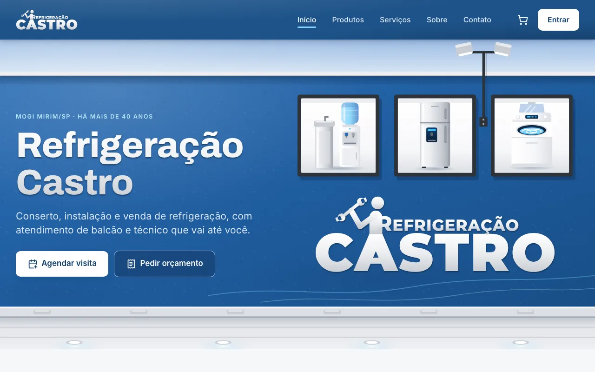
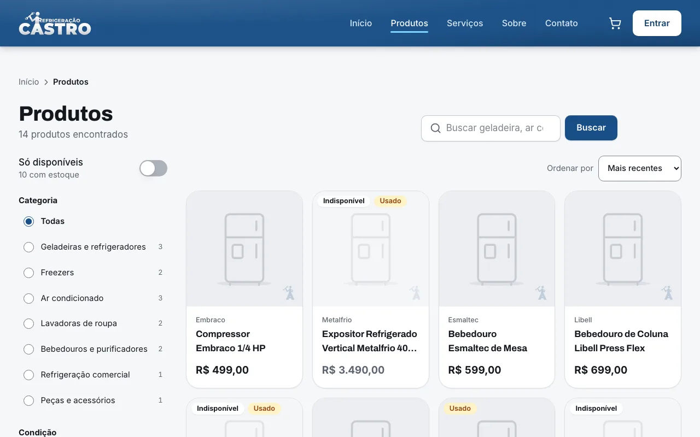

# Refrigeração Castro

Sistema da Refrigeração Castro, loja de família em Mogi Mirim/SP que conserta geladeiras, freezers, lavadoras e ar condicionado há mais de 40 anos. Em um só lugar o sistema reúne o site da loja, a loja online com retirada no balcão, os pedidos de visita técnica e de orçamento, a agenda dos técnicos e o painel da equipe. O código é aberto (licença MIT) e pode servir de ponto de partida para outras lojas do segmento.

<p align="center">
  
</p>

## O que o sistema faz

* **Clientes** criam a conta, compram produtos novos e usados para retirar na loja, pedem visita técnica com fotos do problema e as datas que ficam boas, pedem orçamentos e acompanham tudo em Minha conta.
* **Colaboradores** (técnicos) veem a visita do dia no celular, finalizam o serviço com fotos e fazem vendas no balcão.
* **Gerentes** cuidam da fila de pedidos, aprovam solicitações, montam a agenda, respondem orçamentos, cadastram produtos e acompanham os indicadores do painel.
* **O super usuário** cadastra a equipe, configura a loja, organiza categorias e tipos de serviço e consulta a trilha de auditoria.

O passo a passo de cada papel, com imagens, está no [manual do usuário](docs/MANUAL.md).

## Telas

| Página inicial | Catálogo | Painel da equipe |
|---|---|---|
|  |  |  |

## Tecnologias

* **API:** Node.js 24, Fastify 5, Zod com OpenAPI 3.1 gerada, Drizzle ORM, PostgreSQL 17, Argon2id, JWT com refresh rotativo, Nodemailer, sharp e um worker com outbox no próprio banco.
* **Site:** Nuxt 4, Vue 3, Tailwind CSS v4, Reka UI, Pinia, FullCalendar e cliente da API tipado a partir da OpenAPI.
* **Qualidade:** TypeScript estrito, ESLint, Prettier, dependency cruiser, Vitest com 100% de cobertura, Playwright em celular, tablet e desktop, axe, Lighthouse CI e Schemathesis.
* **Entrega:** imagens Docker da API (com o worker) e do site, Docker Compose e Caddy com HTTPS automático.

A arquitetura está em [docs/ARQUITETURA.md](docs/ARQUITETURA.md) e as decisões em [docs/adr](docs/adr/README.md).

## Como executar

Requisitos: Node.js 24 ou mais recente, pnpm 12 e Docker.

```
pnpm install
pnpm dev
```

O comando cria o `.env` a partir de `infra/env.sample`, sobe o PostgreSQL e o Mailpit no Docker, compila os pacotes, aplica as migrações, carrega os dados de exemplo e inicia a API, o worker e o site.

* Site: http://localhost:3000
* API: http://localhost:3001 (documentação navegável em `/api/docs`)
* Emails enviados em desenvolvimento: http://localhost:8025

Contas de exemplo, todas com a senha `Castro-Dev-2026`: `admin@castro.dev` (super usuário), `gerente@castro.dev`, `tecnico@castro.dev` e `cliente@castro.dev`.

Para produção, veja o [guia de operação](docs/OPERACAO.md).

## Como testar

```
pnpm lint          # ESLint e Prettier
pnpm typecheck     # TypeScript em todos os pacotes
pnpm depcruise     # fronteiras entre os módulos da API
pnpm test          # unitários e integração com PostgreSQL real, cobertura de 100%
pnpm test:e2e      # Playwright em celular, tablet e desktop, com axe
```

Os testes de integração usam o PostgreSQL do `pnpm db:up`. Detalhes em [docs/TESTES.md](docs/TESTES.md) e em [CONTRIBUTING.md](CONTRIBUTING.md).

## Documentação

* [Manual do usuário por papel](docs/MANUAL.md)
* [Guia de operação: deploy, backups e monitoramento](docs/OPERACAO.md)
* [A loja: história, dados e serviços](docs/LOJA.md)
* [Requisitos](docs/REQUISITOS.md), [casos de uso complementares](docs/CASOS_DE_USO_NOVOS.md) e a [definição original](definicao.md)
* [Modelo de domínio](docs/DOMINIO.md), [arquitetura](docs/ARQUITETURA.md) e [API REST](docs/API.md)
* [Identidade visual e design system](docs/DESIGN.md)
* [Testes](docs/TESTES.md) e [segurança](docs/SEGURANCA.md)
* [Decisões de arquitetura (ADRs)](docs/adr/README.md)
* [Roteiro de milestones](docs/ROTEIRO.md) e [diagnóstico do protótipo de 2022](docs/DIAGNOSTICO.md)

## Quer contribuir?

O projeto é aberto e toda contribuição é bem vinda. As tarefas ficam nas [issues](https://github.com/renanleonellocastro/loja_de_refrigeracao/issues); leia o [CONTRIBUTING.md](CONTRIBUTING.md), escolha uma, faça o fork e abra um pull request.
