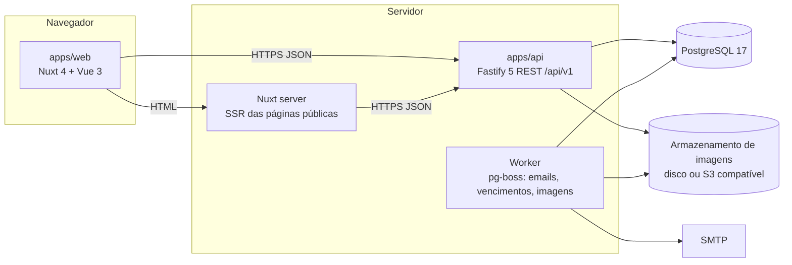

# Arquitetura

Mantém a decisão original do projeto (JavaScript no navegador e no servidor, Vue.js e Node.js) e a atualiza para ferramentas atuais, com TypeScript estrito. As escolhas e alternativas estão nas ADRs em [`adr/`](adr/).

## 1. Visão geral



* **apps/web**: Nuxt 4 (Vue 3, Composition API, `<script setup lang="ts">`). Páginas públicas (início, catálogo, produto, serviços, contato) renderizadas no servidor para SEO local e carregamento rápido; área logada (cliente e equipe) como SPA.
* **apps/api**: Fastify 5 em TypeScript. API REST única para tudo, inclusive para o próprio site. Esquemas Zod geram validação, tipos e a especificação OpenAPI 3.1.
* **Worker**: mesmo pacote da API, outro processo, consumindo a fila `pg-boss` (no próprio PostgreSQL, sem Redis): envio de emails, geração de variantes de imagem, vencimento de orçamentos, lembretes de visita.
* **packages/contracts**: OpenAPI gerada, cliente TypeScript gerado (`openapi-typescript` + `openapi-fetch`), matriz de permissões, enums de estado. Fonte única para API e web.
* **packages/design-tokens**: cores, tipografia, espaçamentos, raios, sombras e movimento da marca, exportados para CSS (Tailwind CSS v4) e para os templates de email.

## 2. Estrutura do repositório

```
apps/
  api/
    src/
      app.ts                  composição do Fastify (plugins, rotas)
      config.ts               variáveis de ambiente validadas com Zod
      modules/
        auth/                 rotas, serviço, repositório, esquemas, testes
        users/
        catalog/              categorias, produtos, imagens, estoque
        orders/               carrinho, pedidos, balcão
        services/             tipos, solicitações, agenda, finalização
        quotes/
        notifications/
        settings/
        audit/
      shared/                 erros RFC 9457, paginação, dinheiro, relógio, ids
      infra/                  banco (Drizzle), email, armazenamento, fila
    drizzle/                  migrações SQL versionadas
    test/                     fábricas, banco de teste, utilitários
  web/
    app/
      pages/                  rotas por arquivo
      layouts/                public, customer, staff
      components/             base (design system) e de domínio
      composables/            useApi, useAuth, useCart, useBreakpoint
      stores/                 Pinia
    tests/                    unitários e de componente
  e2e/                        Playwright: um arquivo por caso de uso
packages/
  contracts/
  design-tokens/
docs/
infra/
  docker/                     Dockerfiles multi estágio
  compose.yaml                PostgreSQL, Mailpit, MinIO opcional
```

Cada módulo da API segue a mesma divisão em camadas, com dependência só para dentro:

```
routes.ts      HTTP: esquemas, autenticação, autorização, códigos de estado
service.ts     regras de negócio, transações, máquinas de estado
repository.ts  SQL via Drizzle; único lugar que conhece tabelas
schemas.ts     Zod: entrada, saída, enums
```

Regras checadas no CI: rotas não importam repositórios; módulos só se falam pelos serviços uns dos outros; `shared` não importa módulos.

## 3. Fluxos principais

### Autenticação

1. `POST /api/v1/auth/sessions` com email e senha devolve o token de acesso (JWT de 15 minutos, mantido só em memória no navegador) e grava o refresh token em cookie `HttpOnly; Secure; SameSite=Strict; Path=/api/v1/auth`.
2. O cliente da API renova o token em `POST /api/v1/auth/sessions/refresh` quando recebe `401` ou antes de expirar; o refresh token é rotativo e a reutilização de um token antigo revoga a sessão inteira.
3. `DELETE /api/v1/auth/sessions/current` encerra a sessão.

### Pedido online

1. O carrinho vive em `/api/v1/me/cart`.
2. `POST /api/v1/orders` com `Idempotency-Key` abre uma transação: congela preços, reserva estoque com `UPDATE` condicional, cria o pedido em `PENDING_REVIEW`, grava o evento e enfileira os emails (outbox). Qualquer item sem estoque cancela tudo e devolve `409` listando os itens.
3. O worker envia os emails depois do commit.

### Serviço

Solicitação (`REQUESTED`) → conversa → aprovação → `POST /api/v1/appointments` (com verificação de conflito pela restrição de exclusão do banco) → colaborador envia o relatório pelo celular → gerente aprova com o valor → email ao cliente.

## 4. Desempenho

* Consultas com índices definidos junto das migrações (busca de produtos com `pg_trgm` para nome, marca e modelo; índices por estado e data nas filas).
* Paginação com `limit` máximo de 100; listas grandes da equipe usam cursor.
* `ETag` nas leituras públicas de catálogo e `Cache-Control` adequado; imagens com nome por conteúdo e cache de um ano.
* Nuxt: SSR com cache por rota nas páginas públicas, divisão de código por rota, `@nuxt/image` para variantes responsivas, fontes auto hospedadas com `font-display: swap` e subconjunto latino.
* Orçamentos de desempenho verificados no CI (Lighthouse CI e tamanho de bundle) e teste de carga k6 antes do lançamento.

## 5. Configuração

Todas as variáveis em `.env` (modelo em `infra/env.sample`), validadas na inicialização; o processo não sobe com configuração inválida. Nenhum segredo no repositório.

| Variável | Uso |
|---|---|
| `DATABASE_URL` | Conexão PostgreSQL |
| `JWT_SECRET` | Assinatura do token de acesso |
| `APP_ORIGIN` | Origem do site, usada no CORS e nos links dos emails |
| `SMTP_URL`, `MAIL_FROM` | Envio de emails |
| `STORAGE_DRIVER`, `STORAGE_PATH` ou `S3_*` | Imagens |
| `TZ=America/Sao_Paulo` | Fuso padrão |

## 6. Ambientes

* **Local**: `pnpm dev` sobe PostgreSQL e Mailpit (caixa de emails de teste em `http://localhost:8025`), aplica migrações, cria dados de exemplo e inicia API, worker e web com recarga automática.
* **CI**: GitHub Actions com serviços PostgreSQL, todos os portões de [TESTES.md](TESTES.md).
* **Produção**: imagens Docker da API (com worker) e da web; destino em decisão (ADR 0012).
