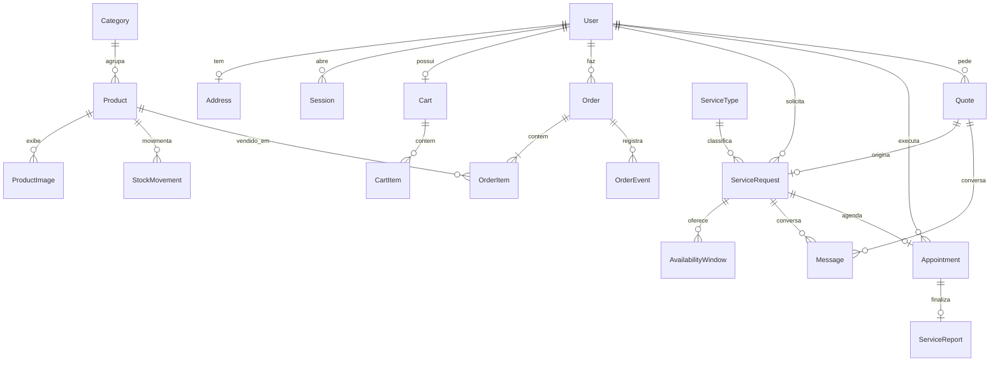
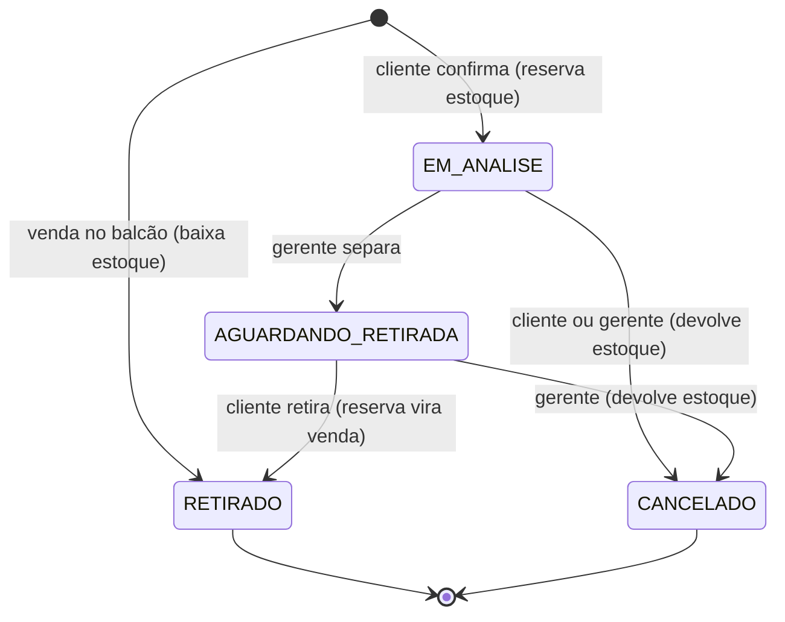
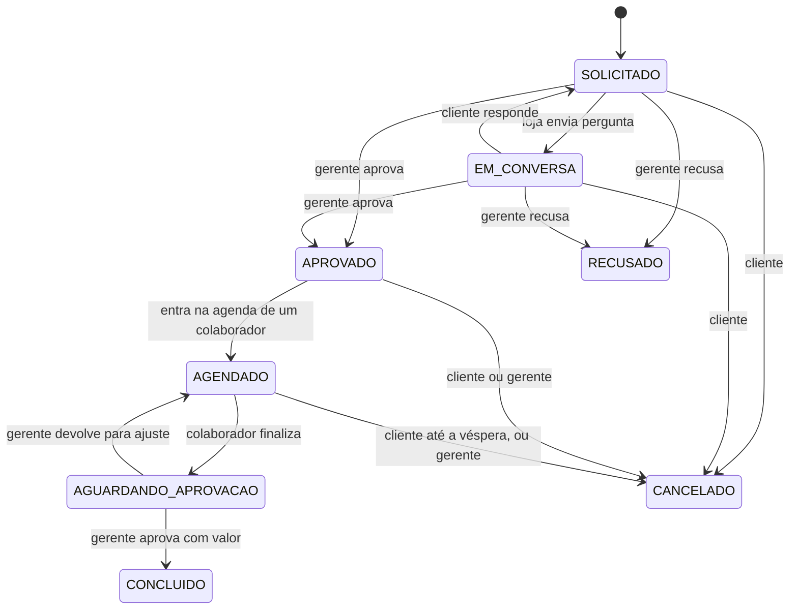
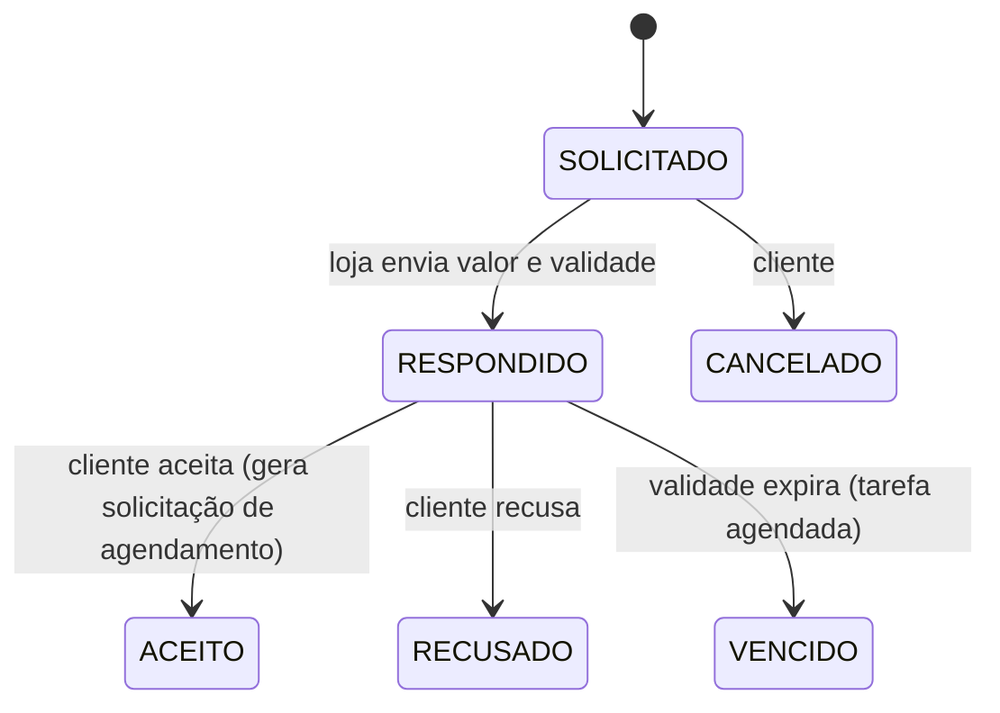

# Modelo de domínio

Entidades, estados e invariantes. Nomes no código em inglês (ADR 0015); a tabela traz o termo usado na interface.

## 1. Entidades

| Código | Interface | Observações |
|---|---|---|
| `User` | Usuário | Papel (`ADMIN`, `MANAGER`, `EMPLOYEE`, `CLIENT`), email único (sem diferenciar maiúsculas), CPF opcional para cliente, `deletedAt` para exclusão lógica. |
| `Address` | Endereço | CEP, rua, número, complemento, bairro, cidade, UF. Um por usuário na versão 1. |
| `Session` | Sessão | Refresh token (hash), dispositivo, validade, revogação. |
| `Category` | Categoria | Nome único, posição para ordenar. |
| `Product` | Produto | Nome, slug, categoria, marca, modelo, condição (`NEW`, `USED`), descrição, preço em centavos, estoque mínimo, `archivedAt`, `version` para concorrência otimista. |
| `ProductImage` | Foto do produto | Chave no armazenamento, posição, capa, largura e altura originais. |
| `StockMovement` | Movimentação de estoque | Tipo (`IN`, `ADJUSTMENT`, `LOSS`, `RESERVATION`, `RELEASE`, `SALE`), quantidade com sinal, motivo, autor, pedido relacionado. A quantidade disponível é derivada e mantida em `Product.stockAvailable` dentro da mesma transação. |
| `Cart` e `CartItem` | Carrinho | Um por usuário; itens com produto e quantidade. |
| `Order` e `OrderItem` | Pedido | Número sequencial legível (`RC-000123`), cliente, canal (`ONLINE`, `COUNTER`), estado, total; o item guarda o preço unitário do momento da compra. |
| `OrderEvent` | Linha do tempo do pedido | Estado anterior, novo estado, autor, motivo, data. |
| `ServiceType` | Tipo de reparo/manutenção | Nome, descrição, duração estimada em minutos, ativo. |
| `ServiceRequest` | Solicitação de agendamento | Cliente, tipo de serviço, tipo de produto, marca, modelo, descrição do problema, janelas disponíveis, fotos, estado, orçamento de origem (opcional). |
| `AvailabilityWindow` | Data disponível | Data e período (`MORNING`, `AFTERNOON`) informados pelo cliente. |
| `Message` | Mensagem | Conversa entre loja e cliente ligada a uma solicitação ou orçamento. |
| `Appointment` | Serviço na agenda | Solicitação, colaborador, início, fim, endereço do atendimento, `version`. |
| `ServiceReport` | Relatório de finalização | Defeito encontrado (sim ou não), descrição do defeito, reparo realizado, fotos, valor aprovado, aprovador. |
| `Quote` | Orçamento | Cliente, tipo de serviço, descrição, fotos, valor, validade, itens incluídos, estado. |
| `Notification` | Notificação | Destinatário, tipo, recurso, lida em. |
| `AuditLog` | Auditoria | Autor, ação, recurso, antes, depois, IP, data. |
| `StoreSettings` | Configurações da loja | Registro único. |

## 2. Máquinas de estado

As transições são as únicas permitidas. Cada uma é uma função pura testada exaustivamente (todas as combinações de estado e ação), e a API devolve `409 Conflict` para transições inválidas.

### Pedido

Código: `PENDING_REVIEW`, `READY_FOR_PICKUP`, `PICKED_UP`, `CANCELED`.

### Solicitação de agendamento

Código: `REQUESTED`, `AWAITING_CUSTOMER`, `APPROVED`, `SCHEDULED`, `AWAITING_COMPLETION_APPROVAL`, `COMPLETED`, `REJECTED`, `CANCELED`.

### Orçamento

Código: `REQUESTED`, `ANSWERED`, `ACCEPTED`, `DECLINED`, `EXPIRED`, `CANCELED`.

## 3. Invariantes

1. `Product.stockAvailable` nunca fica negativo. Reserva e baixa usam `UPDATE ... SET stock_available = stock_available - $n WHERE id = $id AND stock_available >= $n` dentro da transação do pedido; zero linhas afetadas resulta em `409` com os itens sem estoque.
2. Dinheiro é sempre inteiro em centavos (`BIGINT`), formatado só na apresentação.
3. Um colaborador não tem dois `Appointment` sobrepostos (restrição de exclusão no PostgreSQL com `tstzrange`, além da validação na API).
4. O preço do item do pedido é congelado na criação; editar o produto não altera pedidos antigos.
5. Dados pessoais anonimizados não voltam; o email anonimizado fica livre para novo cadastro.
6. Toda mudança de estado gera um evento (linha do tempo) e uma entrada na fila de notificações na mesma transação (padrão outbox).
