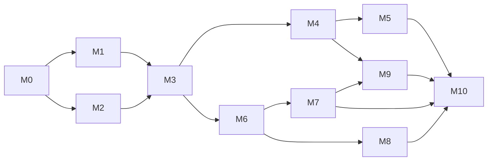

# Roteiro

Plano de execução do replanejamento de 03/10/2026. Cada milestone tem um épico no GitHub com as issues na ordem sugerida. A issue de roteiro fixada no repositório espelha este documento.

## Como ler

* Labels: `caso de uso` implementa um caso de uso documentado; `aguardando renan` precisa de resposta; `decisao` registra uma escolha; `legado` toca o protótipo.
* Toda issue segue a definição de pronto: critérios atendidos, 100% de cobertura, E2E nos três dispositivos quando houver tela, zero violações do axe, OpenAPI e documentação atualizadas.
* Cada issue vira um PR pequeno a partir de `main`; o CI bloqueia o merge se algum portão falhar.
* Primeiras respostas necessárias: #14 (aprovação do replanejamento) e #15 (informações da loja).

## Ordem e dependências

## M0 Fundações (épico #13)

Aprovação do replanejamento, monorepo, CI com cobertura de 100%, ambiente local em um comando, higiene do repositório.

* #14 Revisar e aprovar o replanejamento (documentos e ADRs 0001 a 0015)
* #15 Informações pendentes da Refrigeração Castro
* #16 Monorepo pnpm com TypeScript estrito, ESLint e Prettier
* #17 CI no GitHub Actions com portões de qualidade e cobertura de 100%
* #18 Ambiente local em um comando com Docker Compose
* #19 Higiene do repositório: tokens, scripts de teste, licença e README
* #20 Convenções de contribuição: branches, commits, templates de PR e issue

## M1 Marca e design system (épico #21)

Logo vetorial, tokens da marca, biblioteca de componentes acessíveis e layouts responsivos para celular, tablet e desktop. Dependência: depende do M0; anda em paralelo ao M2.

* #22 Logo vetorial da Refrigeração Castro e variações
* #23 Tokens de design da marca com modo claro e escuro
* #24 Biblioteca de componentes base com Storybook
* #25 Layouts responsivos: público, cliente e equipe
* #26 Voz e tom, páginas de erro e estados globais

## M2 Núcleo da API e autenticação (épico #27)

Fastify, OpenAPI, banco com o esquema completo, autenticação segura, autorização por papel e posse, emails assíncronos e auditoria. Dependência: depende do M0.

* #28 Esqueleto da API Fastify 5
* #29 Erros RFC 9457, validação, paginação, filtros e ordenação padrão
* #30 OpenAPI 3.1 gerada, documentação navegável e cliente TypeScript
* #31 Banco: Drizzle, migrações e esquema completo
* #32 Autenticação: entrar, renovar sessão e sair
* #33 Recuperar senha, convites e confirmação de email
* #34 Autorização por papel e posse com matriz testada
* #35 Emails assíncronos com outbox, pg-boss e templates da marca
* #36 Trilha de auditoria das ações administrativas

## M3 Usuários e perfis (épico #37)

Clientes, colaboradores e gerentes: cadastro, consulta, perfil, exclusão com anonimização e LGPD. Dependência: depende do M1 e do M2.

* #38 UC Cadastrar Cliente (autocadastro e pela equipe com convite)
* #39 UC Consultar Clientes com busca instantânea
* #40 UC Consultar e Editar Perfil do Usuário
* #41 UC Excluir Cliente com anonimização
* #42 UC Cadastrar, Consultar e Excluir Colaborador
* #43 UC Cadastrar, Consultar e Excluir Gerente
* #44 LGPD: política de privacidade, exportar e excluir meus dados

## M4 Catálogo e estoque (épico #45)

Categorias, produtos com fotos otimizadas, catálogo público rápido e com SEO, movimentações de estoque. Dependência: depende do M3.

* #46 Gerenciar Categorias
* #47 UC Cadastrar e Editar Produto
* #48 Fotos de produto otimizadas
* #49 UC Consultar Produtos: catálogo público
* #50 Página de detalhes do produto
* #51 UC Excluir Produto com arquivamento
* #52 Movimentar Estoque e alerta de estoque baixo

## M5 Pedidos e vendas (épico #53)

Carrinho, compra online com reserva de estoque, gestão da fila de pedidos, venda no balcão, histórico e remoção do protótipo. Dependência: depende do M4.

* #54 UC Comprar Produto: fechar pedido com reserva de estoque
* #55 Gerenciar Pedidos: fila, estados e etiqueta
* #56 UC Vender Produto no balcão
* #57 Emails e notificações do ciclo do pedido
* #58 Remover o protótipo legado (server/, client/ e branch heroku)
* #8 Adicionar página do carrinho de compras.
* #12 Adicionar histórico de ordens do cliente na página de detalhes do usuário

## M6 Serviços: tipos e solicitações (épico #59)

Tipos de reparo e manutenção, solicitação de agendamento com fotos e datas, conversa com o cliente, aprovação. Dependência: depende do M3; pode começar em paralelo ao M4.

* #60 UC Cadastrar, Consultar, Alterar e Excluir tipos de Reparo/Manutenção
* #61 UC Solicitar Agendamento de Reparo/Manutenção
* #62 Solicitações pendentes: conversar, aprovar ou recusar
* #63 Meus Agendamentos do cliente

## M7 Agenda e execução (épico #64)

Agenda dos técnicos (mês, semana, dia), atribuição sem conflitos, finalização pelo celular e aprovação com valor. Dependência: depende do M6.

* #65 UC Cadastrar Serviço na Agenda do Colaborador
* #66 UC Consultar Agenda (mês, semana, dia e lista)
* #67 UC Alterar e Excluir Serviço da Agenda
* #68 UC Finalizar Serviço pelo celular
* #69 UC Aprovar Finalização de Serviço com valor

## M8 Orçamentos (épico #70)

Solicitação, resposta da loja, aceite ou recusa pelo cliente e vencimento automático. Dependência: depende do M6; pode andar em paralelo ao M7.

* #71 UC Solicitar Orçamento
* #72 Responder Orçamento
* #73 Aceitar ou Recusar Orçamento e vencimento automático

## M9 Site institucional, painel e notificações (épico #74)

Página inicial com a marca, páginas institucionais, SEO local, painel da equipe, central de notificações, configurações da loja e PWA. Dependência: páginas públicas a partir do M4; painel e notificações depois do M7.

* #75 Página inicial da marca
* #76 Páginas institucionais: sobre, serviços e contato
* #77 SEO local
* #78 Painel da equipe com indicadores
* #79 Central de notificações
* #80 Configurar a Loja
* #81 PWA instalável com suporte básico offline

## M10 Qualidade final e lançamento (épico #82)

E2E de todos os casos de uso nos três dispositivos, auditorias de acessibilidade, desempenho e segurança, deploy e documentação final. Dependência: fecha o projeto; E2E e auditorias acompanham cada milestone desde o M1.

* #83 E2E de todos os casos de uso em celular, tablet e desktop
* #84 Auditoria de acessibilidade WCAG 2.2 AA
* #85 Desempenho: Lighthouse CI, bundle e carga com k6
* #86 Revisão de segurança antes do lançamento
* #87 Deploy em produção, backups e monitoramento
* #88 Documentação final e manual por papel
