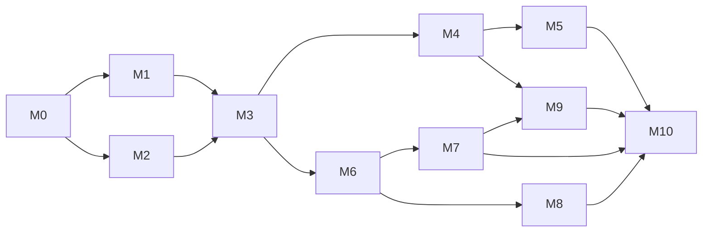

# Roteiro

Plano de execução do replanejamento de 03/10/2026. Cada milestone tem um épico no GitHub com as issues na ordem sugerida. A issue de roteiro fixada no repositório espelha este documento.

## Como ler

* Labels: `caso de uso` implementa um caso de uso documentado; `aguardando renan` precisa de resposta; `decisao` registra uma escolha; `legado` toca o protótipo.
* Toda issue segue a definição de pronto: critérios atendidos, 100% de cobertura, E2E nos três dispositivos quando houver tela, zero violações do axe, OpenAPI e documentação atualizadas.
* Cada issue vira um PR pequeno a partir de `main`; o CI bloqueia o merge se algum portão falhar.
* Primeiras respostas necessárias: #14 (aprovação do replanejamento) e #15 (informações da loja).

## Situação em 05/10/2026

Os PRs #91 a #113 entregaram os milestones M0 a M9 e boa parte do M10. Itens marcados estão entregues e com a issue fechada; os demais seguem abertos com o que falta entre parênteses. M1 e M8 estão completos.

## Ordem e dependências

## M0 Fundações (épico #13)

Aprovação do replanejamento, monorepo, CI com cobertura de 100%, ambiente local em um comando, higiene do repositório.

* [x] #14 Revisar e aprovar o replanejamento (documentos e ADRs 0001 a 0015)
* [ ] #15 Informações pendentes da Refrigeração Castro (pendente: aguarda as informações do dono da loja)
* [x] #16 Monorepo pnpm com TypeScript estrito, ESLint e Prettier
* [x] #17 CI no GitHub Actions com portões de qualidade e cobertura de 100%
* [ ] #18 Ambiente local em um comando com Docker Compose (pendente: falta o seed com pedidos e serviços em vários estados e o passo a passo para Mac, Linux e Windows)
* [x] #19 Higiene do repositório: tokens, scripts de teste, licença e README
* [x] #20 Convenções de contribuição: branches, commits, templates de PR e issue

## M1 Marca e design system (épico #21)

Logo vetorial, tokens da marca, biblioteca de componentes acessíveis e layouts responsivos para celular, tablet e desktop. Dependência: depende do M0; anda em paralelo ao M2.

* [x] #22 Logo vetorial da Refrigeração Castro e variações
* [x] #23 Tokens de design da marca com modo claro e escuro
* [x] #24 Biblioteca de componentes base com guia vivo em `/design`
* [x] #25 Layouts responsivos: público, cliente e equipe
* [x] #26 Voz e tom, páginas de erro e estados globais

## M2 Núcleo da API e autenticação (épico #27)

Fastify, OpenAPI, banco com o esquema completo, autenticação segura, autorização por papel e posse, emails assíncronos e auditoria. Dependência: depende do M0.

* [x] #28 Esqueleto da API Fastify 5
* [x] #29 Erros RFC 9457, validação, paginação, filtros e ordenação padrão
* [x] #30 OpenAPI 3.1 gerada, documentação navegável e cliente TypeScript
* [x] #31 Banco: Drizzle, migrações e esquema completo
* [x] #32 Autenticação: entrar, renovar sessão e sair
* [x] #33 Recuperar senha, convites e confirmação de email
* [ ] #34 Autorização por papel e posse com matriz testada (pendente: falta o teste de dono e não dono na matriz gerada)
* [x] #35 Emails assíncronos com outbox, pg-boss e templates da marca
* [ ] #36 Trilha de auditoria das ações administrativas (pendente: falta proteger a tabela de auditoria contra UPDATE e DELETE no banco)

## M3 Usuários e perfis (épico #37)

Clientes, colaboradores e gerentes: cadastro, consulta, perfil, exclusão com anonimização e LGPD. Dependência: depende do M1 e do M2.

* [x] #38 UC Cadastrar Cliente (autocadastro e pela equipe com convite)
* [x] #39 UC Consultar Clientes com busca instantânea
* [ ] #40 UC Consultar e Editar Perfil do Usuário (pendente: o perfil mostra só os últimos pedidos, sem serviços e orçamentos)
* [x] #41 UC Excluir Cliente com anonimização
* [ ] #42 UC Cadastrar, Consultar e Excluir Colaborador (pendente: excluir um colaborador ainda não sinaliza os serviços futuros dele)
* [x] #43 UC Cadastrar, Consultar e Excluir Gerente
* [ ] #44 LGPD: política de privacidade, exportar e excluir meus dados (pendente: faltam as tarefas agendadas de retenção)

## M4 Catálogo e estoque (épico #45)

Categorias, produtos com fotos otimizadas, catálogo público rápido e com SEO, movimentações de estoque. Dependência: depende do M3.

* [x] #46 Gerenciar Categorias
* [ ] #47 UC Cadastrar e Editar Produto (pendente: faltam as diferenças no aviso de conflito e o formulário em etapas no celular)
* [ ] #48 Fotos de produto otimizadas (pendente: só WebP, sem AVIF e sem adaptador S3)
* [ ] #49 UC Consultar Produtos: catálogo público (pendente: falta cache do catálogo e a verificação do LCP)
* [ ] #50 Página de detalhes do produto (pendente: falta o zoom da galeria)
* [x] #51 UC Excluir Produto com arquivamento
* [ ] #52 Movimentar Estoque e alerta de estoque baixo (pendente: falta a notificação de estoque baixo)

## M5 Pedidos e vendas (épico #53)

Carrinho, compra online com reserva de estoque, gestão da fila de pedidos, venda no balcão, histórico e remoção do protótipo. Dependência: depende do M4.

* [ ] #54 UC Comprar Produto: fechar pedido com reserva de estoque (pendente: falta a tela para a equipe fechar pedido online em nome do cliente)
* [x] #55 Gerenciar Pedidos: fila, estados e etiqueta
* [x] #56 UC Vender Produto no balcão
* [x] #57 Emails e notificações do ciclo do pedido
* [x] #58 Remover o protótipo legado (server/, client/ e branch heroku)
* [x] #8 Adicionar página do carrinho de compras.
* [x] #12 Adicionar histórico de ordens do cliente na página de detalhes do usuário

## M6 Serviços: tipos e solicitações (épico #59)

Tipos de reparo e manutenção, solicitação de agendamento com fotos e datas, conversa com o cliente, aprovação. Dependência: depende do M3; pode começar em paralelo ao M4.

* [x] #60 UC Cadastrar, Consultar, Alterar e Excluir tipos de Reparo/Manutenção
* [x] #61 UC Solicitar Agendamento de Reparo/Manutenção
* [ ] #62 Solicitações pendentes: conversar, aprovar ou recusar (pendente: faltam os contadores por estado na fila)
* [x] #63 Meus Agendamentos do cliente

## M7 Agenda e execução (épico #64)

Agenda dos técnicos (mês, semana, dia), atribuição sem conflitos, finalização pelo celular e aprovação com valor. Dependência: depende do M6.

* [ ] #65 UC Cadastrar Serviço na Agenda do Colaborador (pendente: falta o salvamento automático do formulário)
* [x] #66 UC Consultar Agenda (mês, semana, dia e lista)
* [x] #67 UC Alterar e Excluir Serviço da Agenda
* [x] #68 UC Finalizar Serviço pelo celular
* [x] #69 UC Aprovar Finalização de Serviço com valor

## M8 Orçamentos (épico #70)

Solicitação, resposta da loja, aceite ou recusa pelo cliente e vencimento automático. Dependência: depende do M6; pode andar em paralelo ao M7.

* [x] #71 UC Solicitar Orçamento
* [x] #72 Responder Orçamento
* [x] #73 Aceitar ou Recusar Orçamento e vencimento automático

## M9 Site institucional, painel e notificações (épico #74)

Página inicial com a marca, páginas institucionais, SEO local, painel da equipe, central de notificações, configurações da loja e PWA. Dependência: páginas públicas a partir do M4; painel e notificações depois do M7.

* [x] #75 Página inicial da marca
* [x] #76 Páginas institucionais: sobre, serviços e contato
* [x] #77 SEO local
* [x] #78 Painel da equipe com indicadores
* [x] #79 Central de notificações
* [ ] #80 Configurar a Loja (pendente: o rodapé dos emails ainda usa dados fixos)
* [ ] #81 PWA instalável com suporte básico offline (pendente: falta a sincronização automática ao reconectar)

## M10 Qualidade final e lançamento (épico #82)

E2E de todos os casos de uso nos três dispositivos, auditorias de acessibilidade, desempenho e segurança, deploy e documentação final. Dependência: fecha o projeto; E2E e auditorias acompanham cada milestone desde o M1.

* [ ] #83 E2E de todos os casos de uso em celular, tablet e desktop (pendente: falta a matriz de rastreabilidade e a conferência dos emails)
* [ ] #84 Auditoria de acessibilidade WCAG 2.2 AA (pendente: faltam axe em account.spec.ts, testes de teclado e o registro com leitores de tela)
* [ ] #85 Desempenho: Lighthouse CI, bundle e carga com k6 (pendente: falta o teste de carga com k6)
* [ ] #86 Revisão de segurança antes do lançamento (pendente: falta a varredura com OWASP ZAP)
* [ ] #87 Deploy em produção, backups e monitoramento (pendente: imagens Docker, compose de produção e guia de operação prontos; falta escolher o provedor e publicar)
* [ ] #88 Documentação final e manual por papel (pendente: README, manual por papel e guia de operação entregues neste PR)
